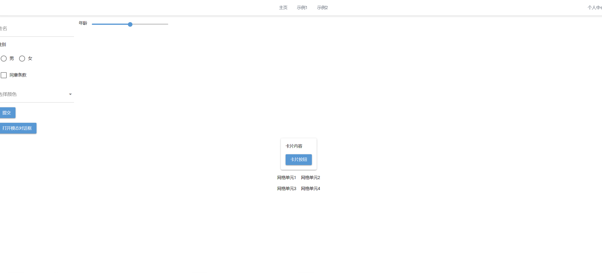

<div align="center">
  <h1>🚀 NiceGUI 脚手架</h1>
  <p>基于 NiceGUI 的应用模板</p>

  <div>
    
    
    
    
    
  </div>

  <div>
    <a href="https://github.com/Ktovoz/niceGUI-template-tutorial/wiki">
      
    </a>
    <a href="https://github.com/Ktovoz/niceGUI-template-tutorial/issues">
      
    </a>
  </div>
</div>

---

## 🌟 核心特性
- 🧩 自动路由注册机制
- 📂 文件路径即路由路径
- 📌 404页面自动处理


---

## 🚀 五分钟快速上手

### 环境准备
```bash
# 克隆仓库 & 进入目录
git clone https://github.com/Ktovoz/niceGUI-template-tutorial && cd niceGUI-template-tutorial

# 创建虚拟环境（可选但推荐）
python -m venv .venv && source .venv/bin/activate  # Linux/MacOS
python -m venv .venv && .venv\Scripts\activate     # Windows

# 一键安装依赖
pip install -r requirements.txt -i https://mirrors.aliyun.com/pypi/simple/
```

### 启动开发服务器
```bash
python main.py
# 浏览器访问 http://localhost:8080
```
## 界面预览

---
## 📂 项目结构
```
├── components/              # 装饰器目录
├── pages/              # 路由目录
│   ├── home.py         # 对应 /
│   ├── page1.py         # 对应 /page1
│   └── err.py         # 404页面
└── main.py            # 入口文件
```
---

## 📦 依赖矩阵

| 模块          | 包名称         | 版本    | 功能说明                  |
|---------------|---------------|---------|-------------------------|
| 核心框架       | nicegui       | 1.4.15  | 响应式UI框架             |
| 日志系统       | loguru        | 0.7.2   | 结构化日志记录           |

---

## 🤝 成为贡献者

欢迎通过以下方式参与贡献：

1. 提交 [Issues](https://github.com/Ktovoz/niceGUI-template-tutorial/issues) 报告问题
2. 发起 [Pull Requests](https://github.com/Ktovoz/niceGUI-template-tutorial/pulls) 提交改进
3. 完善 [项目文档](https://github.com/Ktovoz/niceGUI-template-tutorial/wiki)
4. 分享项目到开发者社区
---
## ❓ 常见问题

### 如何创建新路由？
1. 在`pages`目录新建`.py`文件
2. 文件路径自动转换为路由路径

---

<div align="center">
  <sub>📌 遇到问题？访问 <a href="https://github.com/Ktovoz/niceGUI-template-tutorial/issues">问题追踪</a></sub>
  <br>
  <sub>由 Ktovoz 构建 | 开源让世界更美好 🌍</sub>
  <br>
  <sub>🔄 版本更新于 2025.01 | MIT协议开源</sub>
</div>

<div align="center">
  <h1>🚀 NiceGUI 动态路由框架</h1>
  <p>基于文件系统的轻量级路由解决方案</p>

  
  
  
</div>